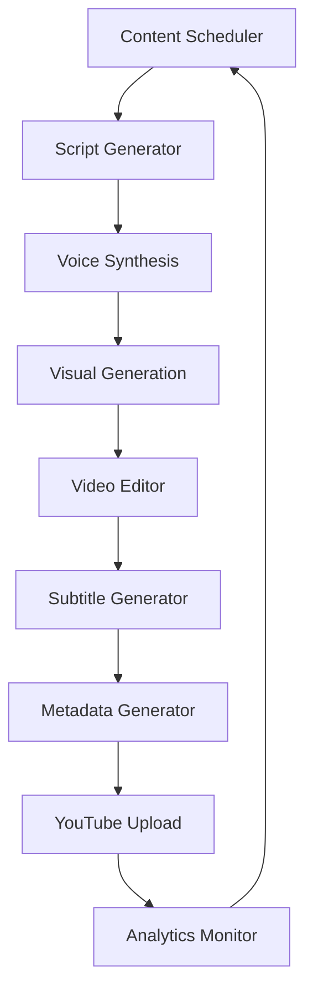

# 🎬 Automated AI Motivational Video Channel

> *Complete guide to building a fully autonomous AI-powered motivational video channel*

---

## 📋 Executive Summary

This research documents how to build a **completely automated** AI motivational video channel from scratch. The pipeline generates scripts, synthesizes voice, sources visuals, edits video, adds subtitles, and uploads to YouTube — all without human intervention.

**Key Discovery:** Coqui TTS is dead (domain hijacked). Use **Piper TTS**, **Melotts**, or **Parler TTS** as free alternatives.

---

## 🏗️ Architecture Overview



### Data Flow

```
┌─────────────────────────────────────────────────────────────────┐
│                    AUTOMATION PIPELINE                           │
├─────────────────────────────────────────────────────────────────┤
│                                                                  │
│  1️⃣  SCHEDULER (cron/Airflow)                                   │
│      └─> Triggers daily at optimal time                         │
│                                                                  │
│  2️⃣  SCRIPT GENERATION (GPT-4/Claude)                           │
│      └─> 60-90 sec motivational script                          │
│      └─> Hook → Story → Lesson → Call-to-action                 │
│                                                                  │
│  3️⃣  VOICE SYNTHESIS (ElevenLabs/OpenAI)                        │
│      └─> High-quality narration                                 │
│      └─> Consistent brand voice                                 │
│                                                                  │
│  4️⃣  VISUAL SOURCING                                             │
│      ├─> Stock footage (Pexels/Pixabay)                        │
│      ├─> AI images (SDXL/Midjourney)                            │
│      └─> B-roll selection                                       │
│                                                                  │
│  5️⃣  VIDEO EDITING (MoviePy + FFmpeg)                           │
│      ├─> Sync voice with visuals                               │
│      ├─> Add transitions                                        │
│      ├─> Background music                                       │
│      └─> Brand overlays                                         │
│                                                                  │
│  6️⃣  SUBTITLES (Whisper API)                                    │
│      └─> Auto-generated SRT/ASS                                │
│                                                                  │
│  7️⃣  METADATA (AI-generated)                                    │
│      ├─> Title optimization                                    │
│      ├─> Description with keywords                             │
│      ├─> Tags                                                   │
│      └─> Thumbnail generation                                   │
│                                                                  │
│  8️⃣  UPLOAD (YouTube Data API)                                  │
│      └─> Scheduled publish                                      │
│                                                                  │
└─────────────────────────────────────────────────────────────────┘
```

---

## 💰 Cost Analysis

### Free Tier Strategy

| Component | Service | Free Tier | Monthly Cost |
|-----------|---------|-----------|--------------|
| Script | OpenAI GPT-4o-mini | 200K tokens/day | **$0** |
| Voice | OpenAI TTS | $5 credit | ~$0.50-2 |
| Voice | Piper TTS (local) | Unlimited | **$0** |
| Visuals | Pexels API | 200 requests/hour | **$0** |
| Video Edit | MoviePy | Unlimited | **$0** |
| Subtitles | Whisper API | No free tier | ~$0.36/hr |
| Subtitles | Whisper (local) | Unlimited | **$0** |
| Upload | YouTube API | 10K units/day | **$0** |
| Music | Free Music Archive | Unlimited | **$0** |

**Minimum viable cost: $0-5/month** (using local models)

### Premium Tier

| Component | Service | Cost |
|-----------|---------|------|
| Script | GPT-4 | ~$10-30/mo |
| Voice | ElevenLabs | $5-22/mo |
| Visuals | Midjourney | $10-60/mo |
| Music | Epidemic Sound | $15/mo |
| Video | Runway Gen-2 | $12-76/mo |
| **Total** | | **$52-203/mo** |

---

## 🛠️ Tech Stack Deep Dive

### 1. Script Generation

**Recommended Models:**

| Model | Provider | Cost | Quality |
|-------|----------|------|---------|
| GPT-4o-mini | OpenAI | $0.15/1M tokens | ⭐⭐⭐⭐ |
| GPT-4o | OpenAI | $2.50/1M tokens | ⭐⭐⭐⭐⭐ |
| Claude 3.5 Haiku | Anthropic | $0.25/1M tokens | ⭐⭐⭐⭐ |
| Llama 3.1 | Local | Free | ⭐⭐⭐ |

**Prompt Template:**
```python
MOTIVATIONAL_SCRIPT_PROMPT = """Write a 60-90 second motivational video script about {topic}.

Structure:
1. HOOK (0-5s): Attention-grabbing opening
2. STORY (5-40s): Relatable struggle/transformation  
3. LESSON (40-70s): Key insight or wisdom
4. CTA (70-90s): Call to action

Tone: Inspiring, authentic, conversational
Avoid: Clichés, generic advice, toxic positivity

Output format:
- Estimated duration per section
- Full script text
- Suggested B-roll descriptions"""
```

### 2. Voice Synthesis

> [!WARNING] Coqui TTS is Dead
> The coqui.ai domain was hijacked. Do not use. Alternatives below.

#### TTS Comparison

| Service | Cost | Quality | Speed | Local |
|---------|------|---------|-------|-------|
| **ElevenLabs** | $5-330/mo | ⭐⭐⭐⭐⭐ | Fast | ❌ |
| **OpenAI TTS** | $0.015/1K chars | ⭐⭐⭐⭐ | Fast | ❌ |
| **Piper TTS** | Free | ⭐⭐⭐ | 10x realtime | ✅ |
| **Melotts** | Free | ⭐⭐⭐⭐ | Medium | ✅ |
| **Parler TTS** | Free | ⭐⭐⭐ | Medium | ✅ |
| **XTTS v2** | Free | ⭐⭐⭐⭐ | Medium | ✅ |

**Piper TTS Setup:**
```bash
# Install
pip install piper-tts

# Download voice
wget https://huggingface.co/rhasspy/piper-voices/resolve/v1.0.0/en/en_US/lessac/medium/en_US-lessac-medium.onnx

# Use
piper-tts --model en_US-lessac-medium.onnx --output_file output.wav --text "Your script here"
```

**OpenAI TTS (Easiest):**
```python
from openai import OpenAI

client = OpenAI()
response = client.audio.speech.create(
    model="tts-1",
    voice="alloy",  # alloy, echo, fable, onyx, nova, shimmer
    input="Your motivational script here"
)
response.stream_to_file("output.mp3")
```

### 3. Visual Sources

#### Stock Footage APIs

| Source | Free Tier | Quality | License |
|--------|-----------|---------|---------|
| **Pexels** | 200 req/hr | ⭐⭐⭐⭐ | CC0 |
| **Pixabay** | 100 req/min | ⭐⭐⭐⭐ | Pixabay License |
| **Unsplash** | 50 req/hr | ⭐⭐⭐⭐⭐ | Unsplash License |

**Pexels API Example:**
```python
import requests

API_KEY = "your_pexels_api_key"
query = "motivation success business"

response = requests.get(
    "https://api.pexels.com/videos/search",
    headers={"Authorization": API_KEY},
    params={"query": query, "per_page": 10, "orientation": "portrait"}
)

videos = response.json()["videos"]
# Download highest quality: videos[0]["video_files"][-1]["link"]
```

#### AI Image Generation

| Service | Cost | Speed | Quality |
|---------|------|-------|---------|
| **SDXL (local)** | Free | Slow | ⭐⭐⭐⭐ |
| **Midjourney** | $10-60/mo | Medium | ⭐⭐⭐⭐⭐ |
| **DALL-E 3** | $0.04/image | Fast | ⭐⭐⭐⭐⭐ |
| **Leonardo.ai** | Free tier | Medium | ⭐⭐⭐⭐ |

### 4. Video Editing

**MoviePy Basics:**
```python
from moviepy.editor import *

# Load assets
voice = AudioFileClip("voice.mp3")
clip1 = VideoFileClip("stock1.mp4").subclip(0, 5)
clip2 = VideoFileClip("stock2.mp4").subclip(0, 10)

# Concatenate
video = concatenate_videoclips([clip1, clip2])

# Add voice
video = video.set_audio(voice)

# Add text overlay
txt = TextClip("Believe in Yourself", fontsize=70, color='white')
txt = txt.set_position('center').set_duration(3)
video = CompositeVideoClip([video, txt])

# Export
video.write_videofile("output.mp4", fps=24)
```

**FFmpeg Commands:**
```bash
# Add background music (ducked)
ffmpeg -i video.mp4 -i music.mp3 -filter_complex \
  "[1:a]volume=0.3[bg];[0:a][bg]amix=inputs=2:duration=first" \
  -c:v copy output.mp4

# Burn subtitles
ffmpeg -i video.mp4 -vf "subtitles=subs.srt" -c:a copy output.mp4

# Resize for YouTube Shorts
ffmpeg -i video.mp4 -vf "scale=1080:1920:force_original_aspect_ratio=decrease,pad=1080:1920:(ow-iw)/2:(oh-ih)/2" -c:a copy short.mp4
```

### 5. Subtitle Generation

**Whisper API:**
```python
from openai import OpenAI

client = OpenAI()

with open("voice.mp3", "rb") as audio:
    transcript = client.audio.transcriptions.create(
        model="whisper-1",
        file=audio,
        response_format="srt"
    )

with open("subtitles.srt", "w") as f:
    f.write(transcript)
```

**Local Whisper (Free):**
```bash
pip install openai-whisper
whisper voice.mp3 --model small --output_format srt
```

### 6. YouTube Upload

> [!IMPORTANT] Setup Required
> 1. Create Google Cloud Project
> 2. Enable YouTube Data API v3
> 3. Create OAuth 2.0 credentials
> 4. Download client_secrets.json

```python
from googleapiclient.discovery import build
from googleapiclient.http import MediaFileUpload
from google.oauth2.credentials import Credentials

def upload_video(video_file, title, description, tags, category_id="22"):
    youtube = build('youtube', 'v3', credentials=creds)
    
    body = {
        'snippet': {
            'title': title,
            'description': description,
            'tags': tags,
            'categoryId': category_id
        },
        'status': {
            'privacyStatus': 'private',  # or 'public', 'unlisted'
            'selfDeclaredMadeForKids': False,
        }
    }
    
    media = MediaFileUpload(video_file, resumable=True)
    request = youtube.videos().insert(part='snippet,status', body=body, media_body=media)
    response = request.execute()
    
    return response['id']
```

### 7. Scheduling

**Simple Cron:**
```bash
# Daily at 8 AM
0 8 * * * cd /path/to/project && python generate_video.py

# Every 6 hours
0 */6 * * * cd /path/to/project && python generate_video.py
```

**Airflow DAG (Production):**
```python
from airflow import DAG
from airflow.operators.python import PythonOperator
from datetime import datetime, timedelta

default_args = {
    'owner': 'airflow',
    'depends_on_past': False,
    'start_date': datetime(2024, 1, 1),
    'retries': 3,
    'retry_delay': timedelta(minutes=5),
}

dag = DAG(
    'motivational_video_pipeline',
    default_args=default_args,
    schedule_interval='0 8 * * *',  # Daily 8 AM
    catchup=False
)

generate_script = PythonOperator(task_id='generate_script', python_callable=generate, dag=dag)
synthesize_voice = PythonOperator(task_id='synthesize_voice', python_callable=voice, dag=dag)
edit_video = PythonOperator(task_id='edit_video', python_callable=edit, dag=dag)
upload = PythonOperator(task_id='upload', python_callable=upload, dag=dag)

generate_script >> synthesize_voice >> edit_video >> upload
```

---

## 📊 YouTube Monetization

### Requirements (2024)

| Metric | Long-form | Shorts |
|--------|-----------|--------|
| Subscribers | 1,000 | 1,000 |
| Watch Hours | 4,000 (12mo) | - |
| Shorts Views | - | 10M (90 days) |

### AI Content Policy

> [!TIP] YouTube allows AI content for monetization IF:
> - Content provides value to viewers
> - Not spam or low-quality
> - Complies with all other policies
> - Disclosed as AI-generated (recommended)

---

## 🚀 Quick Start Guide

### Phase 1: MVP (Week 1) - $0 Cost

```bash
# 1. Setup environment
mkdir ai-motivation-channel && cd ai-motivation-channel
python -m venv venv
source venv/bin/activate

# 2. Install dependencies
pip install moviepy openai python-dotenv requests

# 3. Download Piper TTS voice
mkdir voices && cd voices
wget https://huggingface.co/rhasspy/piper-voices/resolve/v1.0.0/en/en_US/lessac/medium/en_US-lessac-medium.onnx
wget https://huggingface.co/rhasspy/piper-voices/resolve/v1.0.0/en/en_US/lessac/medium/en_US-lessac-medium.onnx.json
cd ..

# 4. Create config
mkdir -p src assets/output
```

**Minimal Script:**
```python
#!/usr/bin/env python3
# src/generate.py
import os
from openai import OpenAI
import subprocess
from moviepy.editor import *

client = OpenAI(api_key=os.getenv("OPENAI_API_KEY"))

def generate_script():
    response = client.chat.completions.create(
        model="gpt-4o-mini",
        messages=[{
            "role": "user",
            "content": "Write a 30-second motivational script about overcoming fear. Hook, story, lesson structure."
        }]
    )
    return response.choices[0].message.content

def generate_voice(text):
    response = client.audio.speech.create(
        model="tts-1",
        voice="alloy",
        input=text
    )
    response.stream_to_file("assets/voice.mp3")

def create_video():
    # Simple: voice + static image
    voice = AudioFileClip("assets/voice.mp3")
    image = ImageClip("assets/background.jpg").set_duration(voice.duration)
    video = image.set_audio(voice)
    video.write_videofile("assets/output/video.mp4", fps=1)

if __name__ == "__main__":
    script = generate_script()
    generate_voice(script)
    create_video()
    print("✅ Video generated: assets/output/video.mp4")
```

### Phase 2: Automation (Week 2-3)

- [ ] Add stock footage integration
- [ ] Add subtitle generation
- [ ] Add YouTube upload
- [ ] Setup cron scheduling
- [ ] Add error handling

### Phase 3: Scale (Week 4+)

- [ ] Multi-platform distribution
- [ ] A/B testing thumbnails
- [ ] Analytics integration
- [ ] Content calendar
- [ ] Brand voice training

---

## 🔧 Troubleshooting

| Issue | Solution |
|-------|----------|
| MoviePy memory error | Use `write_videofile(threads=4, preset='ultrafast')` |
| YouTube API quota exceeded | Implement exponential backoff |
| Voice audio too quiet | Normalize audio: `ffmpeg -i input.mp3 -af loudnorm output.mp3` |
| Stock footage watermarked | Use Pexels/Pixabay (truly free) |
| Subtitles out of sync | Check Whisper model size (small/medium/large) |
| Upload fails | Check OAuth token expiration (refresh tokens) |

---

## 📚 Resources

### Documentation
- [YouTube Data API](https://developers.google.com/youtube/v3)
- [MoviePy Docs](https://zulko.github.io/moviepy/)
- [OpenAI Whisper](https://github.com/openai/whisper)
- [Piper TTS](https://github.com/rhasspy/piper)

### Free Assets
- [Pexels Videos](https://www.pexels.com/videos/)
- [Pixabay](https://pixabay.com/)
- [Free Music Archive](https://freemusicarchive.org/)

### Tutorials
- [Automated YouTube with Python](https://medium.com/illuminations-mirror/how-i-created-my-automated-youtube-channel-only-using-one-ai-tool-5e4a4f1d6d73)
- [Whisper + MoviePy Guide](https://www.digitalocean.com/community/tutorials/how-to-generate-and-add-subtitles-to-videos-using-python-openai-whisper-and-ffmpeg)

---

## 🔗 Related Research

- [[Research - Create motivational video]] (source task)
- [[Research - Voice & Video Pipeline]]
- [[Research - ComfyUI workflow for video content]]
- [[Research Index]]

---

## ✅ Action Items

- [ ] Set up Python environment
- [ ] Get OpenAI API key
- [ ] Create Pexels account + API key
- [ ] Setup YouTube Data API credentials
- [ ] Build MVP script
- [ ] Test end-to-end pipeline
- [ ] Deploy to VPS (optional)
- [ ] Schedule daily runs

---

*Research completed: 2026-02-09*  
*Method: Serper API + Web fetch*  
*Tools verified: Yes*  
*Cost estimates: Current as of 2025* 🤖💕
